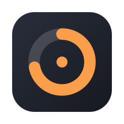
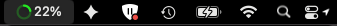
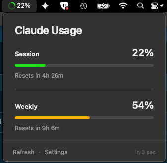
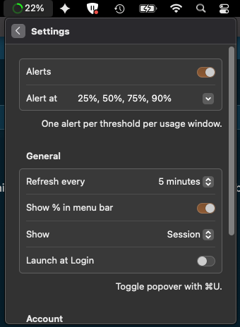

# ClaudeUsageBar

A native macOS menu bar app that shows the session and weekly usage bars
available to supported Claude subscriptions.

> **Independent, non-commercial, unofficial.**
> ClaudeUsageBar is a personal hobby project maintained by volunteers in their
> own time. It is **not affiliated with, endorsed by, sponsored by, or connected
> to Anthropic PBC** in any way. It is given away free of charge, contains no
> advertising, no analytics, no telemetry, and no paid tier, and it neither
> collects nor monetises any user data. Nothing here is an official Anthropic
> product or an official Claude Code component.
>
> "Claude", "Claude Code", and "Anthropic" are trademarks of Anthropic PBC. This
> project is not the trademark owner. Those names appear only descriptively, to
> state which software this tool interoperates with, as permitted for accurate
> descriptive reference. See [Licence and trademarks](#licence-and-trademarks).



## Screenshots



| Popover | Settings |
| --- | --- |
|  |  |

The menu bar reports whichever window you select under **Settings -> Show**. In
the captures above it is set to `Session`, so the menu bar reads 22% while the
weekly bar sits at 54%.

## Requirements

- macOS 13 Ventura or later
- Xcode 15 or later for local development
- Claude Code installed and signed in for live usage data
- A Claude subscription that exposes session and weekly usage bars

The optional styled local DMG workflow also supports the third-party
[`create-dmg`](https://github.com/create-dmg/create-dmg) utility, but falls back
to Apple's built-in `hdiutil` when it is unavailable.

## Privacy and security model

ClaudeUsageBar uses an explicit, read-only **Connect Claude Code** integration.

> ClaudeUsageBar reads your existing Claude Code sign-in from macOS Keychain.
> It never changes or stores your Claude credentials.

- Credential reading is disabled by default. It starts only after you click
  **Connect Claude Code**, and the app persists only that consent choice.
- The app reads `Claude Code-credentials` from macOS Keychain. It never writes,
  refreshes, deletes, or stores that item and never reads or writes
  `~/.claude/.credentials.json`.
- ClaudeUsageBar never discovers, locates, or executes `claude`. It has no
  subprocess or shell authentication path and does not implement OAuth.
- If the credential is absent, the app links to Anthropic's official setup and
  sign-in guidance in your browser. Complete setup in official Claude Code,
  return to ClaudeUsageBar, and click **Retry**.
- **Disconnect from ClaudeUsageBar** disables future reads and clears this
  app's persisted consent, usage state, and cache only. It does not sign out,
  alter, or delete anything in Claude Code.
- No credential, token preview, browser cookie, analytics, or telemetry is
  stored in UserDefaults or logs.
- The macOS App Sandbox is intentionally disabled because the integration reads
  a Keychain item owned by the separately signed Claude Code app after macOS
  access control and explicit user consent. An app-owned sandbox Keychain group
  cannot grant access to that cross-app item; enabling the sandbox would break
  the integration. Hardened Runtime remains enabled.

The credential exists transiently in this app's process memory and is sent only
as an authorization header to the allowlisted HTTPS usage endpoint. See
[SECURITY.md](SECURITY.md) for the threat boundaries and vulnerability
reporting process.

## Anthropic endpoint caveat

Anthropic's current developer guidance says products built for others should use
API-key authentication and prohibits third-party tools that misrepresent
themselves or route traffic against subscription limits. Anthropic does not
document a third-party desktop OAuth-client registration flow for subscription
usage. Accordingly, this project does not ship an app-owned OAuth client, token
exchange, refresh flow, or loopback callback.

Official sources:

- [Claude Code setup](https://code.claude.com/docs/en/setup) — official
  installation methods
- [Claude Code authentication](https://code.claude.com/docs/en/authentication) —
  official sign-in and credential guidance
- [Claude Code legal and compliance](https://code.claude.com/docs/en/legal-and-compliance) —
  third-party authentication and acceptable-use guidance

The consumer endpoint `GET https://api.anthropic.com/api/oauth/usage` is not a
documented public API. It is community-discovered behavior and may change or
stop working without notice. ClaudeUsageBar identifies itself with its own user
agent and does not send Claude CLI identity headers. Written Anthropic approval
is still required before responsible public distribution of any binary that
uses this read-only integration.

## Publication status

The source repository may be published under the MIT license with the
independent-project disclaimer and undocumented-endpoint caveat above. Source
publication is not approval to distribute compiled artifacts.

Do not publish an app, DMG, or other binary until both release gates are met:

1. Written Anthropic approval for this use of the undocumented endpoint.
2. Apple Developer ID signing and notarization credentials, followed by a
   successful notarized release build.

## Connect Claude Code

1. Install and sign in to official Claude Code using
   [Anthropic's setup guide](https://code.claude.com/docs/en/setup).
2. Open ClaudeUsageBar, click **Connect Claude Code**, and approve read-only
   Keychain access if macOS asks.
3. If no credential is available, open the official guidance from the app,
   complete setup externally, return to ClaudeUsageBar, and click **Retry**.

Use **Settings → Account → Disconnect from ClaudeUsageBar** to revoke the app's
read consent and clear its local state. This does not log out Claude Code.

## Features

- Session and weekly usage bars with reset countdowns
- Color-coded menu bar ring and optional percentage, reporting the highest
  window or a specific one (Settings -> Show)
- Manual refresh plus coalesced 5- or 10-minute refreshes
- Local refresh throttling so a burst of clicks cannot flood the endpoint
- Stale/error states that preserve the last successful response
- Optional threshold notifications
- Global ⌘U popover shortcut
- Menu-bar-only presentation, including fullscreen Spaces support

## Build locally

Local scripts are suitable only for source development and local testing.
Publishing the source repository does not make these artifacts suitable for
public distribution.

```bash
chmod +x Scripts/*.sh

# Once per machine. Avoids a Keychain prompt after every rebuild (see below).
./Scripts/create-local-signing-identity.sh

./Scripts/build.sh
```

The built app is written to `dist/ClaudeUsageBar.app`.

### Why the local signing identity matters

An ad-hoc signature's designated requirement is the cdhash of that exact binary,
so every rebuild is a different code identity to macOS. Any Keychain
**Always Allow** grant given to the previous build no longer matches, and the
Claude Code credential prompt returns on every build.

`Scripts/create-local-signing-identity.sh` creates a self-signed code signing
certificate in your login keychain and trusts it for code signing only, for your
user. `Scripts/build.sh` uses it automatically when present and falls back to
ad-hoc signing with a warning when it is absent. This identity is **not** a
Developer ID: it cannot notarize and must never be used for distribution.

After the first build with a stable identity, click **Refresh** once and choose
**Always Allow** in the Keychain prompt. The grant then survives rebuilds.

Claude Code rewriting its own credential item can still reset that item's access
list. That is outside this app's control.

### App icon

The icon is generated from primitives so it carries no third-party copyright or
trademark. Apple licenses SF Symbols for in-app UI but not for app icons or
logos, and this project must not evoke Anthropic's marks.

```bash
swift Scripts/generate-app-icon.swift "$(pwd)"
```

This rewrites `AppIcon.appiconset` and its `Contents.json`. macOS draws
notification icons from the bundle icon, so the bundle must always ship one.

## Tests

Run the Xcode test target and the lightweight logic smoke test:

```bash
xcodebuild test \
  -project ClaudeUsageBar.xcodeproj \
  -scheme ClaudeUsageBar \
  -destination 'platform=macOS' \
  CODE_SIGN_IDENTITY="-"

swift Scripts/smoke-logic.swift
```

The GitHub Actions workflow runs the same checks on a hosted macOS runner
without Developer ID or notarization credentials.

## Local DMG

To create an ad-hoc DMG for local testing:

```bash
./Scripts/create-dmg.sh
```

The output in `dist/` is not notarized and must not be presented as a public
release. Gatekeeper behavior for an ad-hoc build differs from a signed and
notarized distribution.

## Public binary release

Public binaries remain blocked until the project has written Anthropic approval
for the undocumented endpoint and the maintainer has Apple Developer Program
credentials. This repository contains no signing or notarization secrets, and a
notarized artifact cannot be produced without those external credentials.

Required:

- Written Anthropic approval for public binary distribution
- A
  [`Developer ID Application`](https://developer.apple.com/developer-id/)
  certificate installed in the build machine's Keychain
- The corresponding 10-character Apple Developer Team ID
- [Apple notarization](https://developer.apple.com/documentation/security/notarizing-macos-software-before-distribution)
  authentication using either:
  - a Keychain profile created with `xcrun notarytool store-credentials`, or
  - an App Store Connect API key ID, issuer ID, and local `.p8` private-key path

Recommended local setup:

```bash
xcrun notarytool store-credentials "ClaudeUsageBar-notary" \
  --apple-id "MAINTAINER_APPLE_ID" \
  --team-id "TEAMID1234" \
  --password "APP_SPECIFIC_PASSWORD"
```

The password is stored by `notarytool` in Keychain. Do not place it in this
repository or enable shell tracing.

Release command:

```bash
SIGNING_IDENTITY="Developer ID Application: Maintainer Name (TEAMID1234)" \
DEVELOPMENT_TEAM="TEAMID1234" \
NOTARY_PROFILE="ClaudeUsageBar-notary" \
./Scripts/release.sh
```

App Store Connect API-key alternative:

```bash
SIGNING_IDENTITY="Developer ID Application: Maintainer Name (TEAMID1234)" \
DEVELOPMENT_TEAM="TEAMID1234" \
APPLE_API_KEY_ID="KEYID12345" \
APPLE_API_ISSUER="00000000-0000-0000-0000-000000000000" \
APPLE_API_PRIVATE_KEY="/secure/path/AuthKey_KEYID12345.p8" \
./Scripts/release.sh
```

`Scripts/release.sh` fails closed when signing or notary configuration is
missing. It does not verify Anthropic approval; the maintainer must confirm that
external gate before running a public release. The script runs tests, archives a
universal arm64/x86_64 Release app, requires Developer ID signing and Hardened
Runtime, verifies nested signatures, creates and signs a drag-to-Applications
DMG, submits it with `notarytool`, staples it, and validates it with `codesign`,
`spctl`, and `stapler`.

## Rate limiting

Anthropic's endpoint returns 429 with `Retry-After` when it is unhappy. The app
honors that, but it also shapes requests before they leave the machine so a user
holding down **Refresh** cannot cause the problem in the first place.

User-initiated refreshes pass through a token bucket: three refreshes may run
back to back, then one more is earned every 20 seconds. A blocked click relabels
the button `Wait Ns` rather than silently doing nothing. Startup and the 5- or
10-minute timer bypass the bucket because they are already bounded.

The credential is also cached in process memory between refreshes, so a refresh
no longer costs a Keychain read. The cache is never written to disk, is never
used within two minutes of the token's stated expiry, is never used at all for a
token with no stated expiry, is bypassed after a 401, and is cleared on
disconnect.

## How refresh works

All startup, timer, manual, and popover refresh requests join one in-flight
operation. On expiration or HTTP 401, ClaudeUsageBar re-reads the Claude Code
Keychain item; it never refreshes the credential itself. A rotated access
credential is retried once. If no valid credential is available, the UI directs
the user to official external setup and offers **Retry**.

Disconnect increments a connection generation, cancels any in-flight work,
disables future Keychain reads, and clears app state and cached usage. It does
not log out Claude Code. Late Keychain or network responses cannot restore
connected state or overwrite newer state.

## Contributing

Contributions are welcome. This is a small hobby project, so the bar is
practical rather than bureaucratic: if something is broken or missing, open an
issue or send a pull request.

1. Fork the repository and branch from `main`
   (`fix/refresh-error-state`, `feat/menu-bar-window-picker`).
2. Run the tests before pushing:
   ```bash
   xcodebuild test -project ClaudeUsageBar.xcodeproj -scheme ClaudeUsageBar \
     -destination 'platform=macOS' CODE_SIGN_IDENTITY="-"
   swift Scripts/smoke-logic.swift
   ```
3. Open a pull request. The template asks three short questions.

Two rules exist because they protect users rather than the project:

- Keep the credential path read-only and opt-in. Do not add code that writes,
  refreshes, or deletes the Claude Code Keychain item, that discovers or
  executes `claude`, or that implements an app-owned OAuth flow.
- Never commit credentials, tokens, or unsanitised screenshots.

[CONTRIBUTING.md](CONTRIBUTING.md) has the longer version. By contributing you
agree your work is released under the MIT licence below.

## Licence and trademarks

Source code and generated artwork: MIT — see [LICENSE](LICENSE). The MIT licence
covers this project's own code and assets only.

All icon and status-ring artwork in this repository is generated from geometric
primitives by `Scripts/generate-app-icon.swift` and
`ClaudeUsageBar/UI/SparkIconRenderer.swift`. It contains no third-party artwork,
no vendor logo, and no SF Symbol, and deliberately does not resemble any
Anthropic mark.

### Trademark notice

"Anthropic", "Claude", and "Claude Code" are trademarks of Anthropic PBC.
"Apple", "macOS", "Xcode", and "SF Symbols" are trademarks of Apple Inc. This
project is not affiliated with, endorsed by, or sponsored by either company, and
claims no rights in their marks.

Those names are used here only in a descriptive sense, to identify the software
this tool works alongside. This project does not use any Anthropic logo, icon,
wordmark, brand colour, or other brand asset, and does not copy or redistribute
any Anthropic or Apple source code.

If Anthropic PBC or Apple Inc. believes any part of this project misuses their
marks or content, please open an issue or contact the maintainer through the
address in [SECURITY.md](SECURITY.md). The maintainer's intent is to comply
promptly and in good faith, including renaming or removing material on request.
